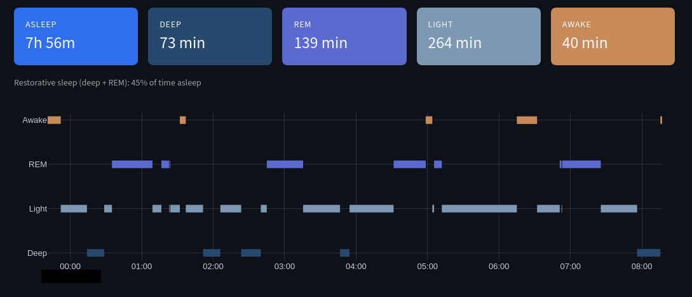
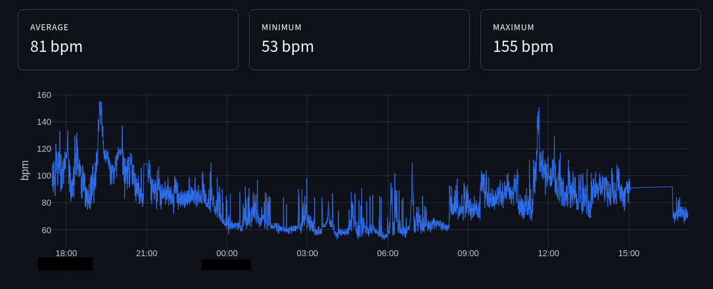

# ProjectFitBit

A self-hosted personal health dashboard for Fitbit devices, built on the Google Health API. It syncs your sleep, heart rate, steps and exercise data into a local SQLite database and renders an interactive dashboard with Streamlit. It can also be installed on your phone as a PWA, served securely from your own machine over Tailscale. No third-party services, no cloud storage: your health data stays on your machine.

## Architecture

```
Fitbit device --> Fitbit app (phone) --> Google cloud
                                             |
                                   Google Health API (v4)
                                             |
                     ingest.py (run.sh loop / cron) --> SQLite
                                             |
                                   app.py (Streamlit dashboard)
                                             |
                          Tailscale HTTPS --> PWA on your phone
```

- `auth.py` runs once and performs the OAuth 2.0 flow against Google, storing a refresh token locally.
- `ingest.py` refreshes the access token automatically and downloads new data points incrementally into `projectfitbit.db`.
- `app.py` is the Streamlit dashboard that reads the database. It never talks to the API.
- `run.sh` launches everything: one immediate ingestion, a background loop that re-ingests every 15 minutes while the dashboard is open, and the Streamlit server.
- `static/` contains the PWA assets (manifest, service worker, icons).

## Requirements

- A Fitbit device linked to a Google account.
- Python 3.10 or later (3.12 tested) on Linux.
- A Google Cloud project (free tier is enough).
- Optional, for the mobile PWA: a free Tailscale account.

## Step 1: Google Cloud setup

1. Go to https://console.cloud.google.com and create a new project.
2. Open "APIs & Services" > "Library", search for **Google Health API** and click **Enable**. Make sure you enable it in the same project where you will create the credentials.
3. Open "APIs & Services" > "OAuth consent screen". Choose **External**, keep the app in **Testing** mode and add your own Google account as a test user. All Google Health API scopes are classified as Restricted; keeping the app in Testing mode lets you use it with your own account without going through Google's verification review.
4. Open "APIs & Services" > "Credentials" > "Create credentials" > **OAuth client ID**. Select application type **Desktop app**. Download the JSON file from the confirmation dialog.
5. Save the downloaded file as `client_secret.json` in the project root and restrict its permissions:

```bash
chmod 600 client_secret.json
```

Important: do not confuse the OAuth client with a service account. Service account keys (files containing a `private_key` field) will not work here, because the Health API requires user consent.

## Step 2: Installation

```bash
git clone <your-repo-url>
cd ProjectFitBit
python3 -m venv venv
source venv/bin/activate
pip install google-auth google-auth-oauthlib streamlit plotly pandas
```

## Step 3: One-time authorization

```bash
python3 auth.py
```

A browser window opens. Sign in with the Google account linked to your Fitbit, accept the three read-only scopes (sleep, activity and fitness, health metrics and measurements). Because the app is in Testing mode, Google shows an "unverified app" warning: click "Advanced" and continue.

On success the script writes `tokens.json` (permissions 600) containing the refresh token. You should see `Refresh token present: True`. If it prints `False`, revoke the app's access at https://myaccount.google.com/permissions and run it again.

## Step 4: Data ingestion and the database

```bash
python3 ingest.py
```

The first run backfills the last 30 days. The script creates `projectfitbit.db` with three tables:

- `raw_points`: every data point exactly as returned by the API (JSON payload), keyed by data type and timestamp. Sleep sessions keep their full stage breakdown here.
- `cardio`: a flat `(timestamp, bpm)` table for fast heart rate queries.
- `estado`: the last synced timestamp per data type, used for incremental syncs.

Subsequent runs only fetch data newer than the last sync, with a 60 minute overlap window; duplicate points are absorbed by `INSERT OR REPLACE`.

Note on data types: sample types (`heart-rate`) and daily types (`daily-resting-heart-rate`) support server-side time filters. Session types (`sleep`, `exercise`) reject filters on this API version, so they are downloaded in full on each run; their volume (one or a few points per day) makes this negligible.

Note on step sources: the dashboard counts only steps reported by the wearable (`platform = FITBIT`) and excludes the phone pedometer (`MobileTrack` device) to avoid double counting the same walks from multiple sources.

## Step 5: Dashboard

The recommended way is the launcher script:

```bash
./run.sh
```

It runs one ingestion immediately, keeps re-ingesting every 15 minutes in the background while the dashboard is open, and starts Streamlit. Closing the dashboard also stops the background loop.

Optional convenience alias:

```bash
alias fitbit='~/projects/ProjectFitBit/run.sh &'
```

Now you can launch the dashboard with only one command:

```bash
fitbit
```

Alternatively, if you prefer ingestion to run even when the dashboard is closed, schedule it with cron and start Streamlit manually:

```
*/15 * * * * cd /path/to/ProjectFitBit && ./venv/bin/python3 ingest.py >> ingest.log 2>&1
```

Open http://localhost:8501. The dashboard has five tabs:

- **Sleep**: night selector, per-stage metrics (deep, REM, light, awake) with color-coded cards, a restorative sleep percentage, an interactive hypnogram and a nightly duration trend. Nights are labeled with a noon cutoff, so going to bed after midnight still counts as the previous night.
- **Heart rate**: intraday chart with a 1-30 day range slider, average/min/max, and the resting heart rate trend.
- **Activity**: daily step totals and a 30-day average.
- **Exercise**: a table of tracked workout sessions with a raw-detail expander.
- **Analysis**: a transparent daily score (0-100, built from sleep duration, restorative sleep, steps and resting heart rate vs your own baseline) and a correlation explorer that cross-references your daily metrics once at least 5 days of data have accumulated.

Set your time zone in `app.py` (`TZ` constant) before first use.

## Step 6: Install it on your phone (PWA over Tailscale)

The dashboard can be installed on your phone as a Progressive Web App with its own icon and full-screen look, reachable from any network. Chrome only allows PWA installation over HTTPS, and Streamlit does not support PWAs natively, so this step has two small tricks: patching Streamlit's HTML template and serving over Tailscale.

1. Enable static file serving and LAN access. Create `.streamlit/config.toml`:

```toml
[server]
enableStaticServing = true
address = "0.0.0.0"
```

The `static/` directory (already in this repo) contains `manifest.json`, `sw.js` and the app icons, served by Streamlit at `/app/static/`.

2. Inject the manifest and service worker into Streamlit's HTML template. Streamlit does not allow modifying the page `<head>` from `app.py`, so patch the template inside the venv (one reversible line):

```bash
sed -i 's|</head>|<link rel="manifest" href="/app/static/manifest.json"/><script>if("serviceWorker" in navigator){navigator.serviceWorker.register("/app/static/sw.js",{scope:"/"})}</script></head>|' \
  venv/lib/python3.12/site-packages/streamlit/static/index.html
```

Adjust the Python version in the path if needed. Caveat: upgrading Streamlit with pip overwrites this file, so re-run the sed after any upgrade.

3. Serve over HTTPS with Tailscale:

```bash
sudo tailscale up
sudo tailscale serve --bg https / http://localhost:8501
tailscale serve status
```

The status command prints your HTTPS URL, e.g. `https://yourmachine.your-tailnet.ts.net`, with a valid certificate generated automatically. If prompted, enable MagicDNS and HTTPS certificates in the Tailscale admin console (one click). Nothing is exposed to the public internet: only devices in your tailnet can reach it.

4. On your phone, install the Tailscale app and sign in with the same account. Open the HTTPS URL in Chrome, then menu > **Install app**. You get a home screen icon and a full-screen native-like experience, working from any network as long as the Tailscale VPN is enabled on the phone.

Note: the phone app is a window into your machine. The computer must be on and the dashboard running (`fitbit`) for the app to show data.

## Security notes

- `client_secret.json`, `tokens.json`, `*.db` and `*.log` are listed in `.gitignore`. Never commit them: the refresh token grants long-lived read access to your health data.
- If a secret ever leaks, reset the client secret in Google Cloud Console and revoke the app at https://myaccount.google.com/permissions, then re-run `auth.py`.
- All scopes requested are read-only.
- The PWA is only reachable inside your Tailscale network; no ports are opened to the internet.

## Screenshots

### Sleep
Night selector, per-stage metrics and the interactive hypnogram.



### Heart rate
Intraday chart with range slider and resting heart rate trend.



## Roadmap

- Automatic text insights (weekly summaries and anomaly highlights).
- Configurable score targets from the UI.
- systemd user service to keep the server running 24/7.
- Multi-user support via the same OAuth flow (requires Google's restricted-scope verification).
- Replace polling with Health API webhook subscriptions.
- Source reconciliation for step counts using the API's `reconcile` endpoint.

## License

MIT
